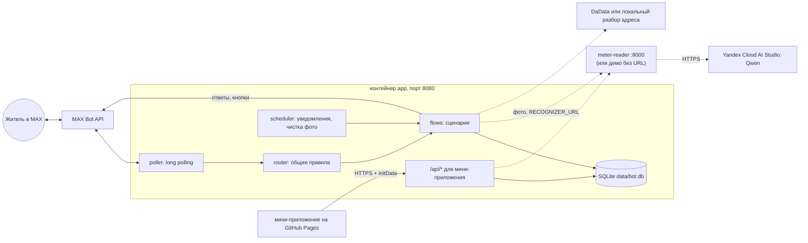

# Единый бот ЖКХ в MAX

Чат-бот и мини-приложение для мессенджера MAX (хакатон «Умный город»). Житель регистрируется один раз
и дальше подаёт показания счётчиков, просто присылая фото в чат. Бот напоминает о сроках подачи,
поверки и оплаты, у каждого напоминания есть кнопка действия.

- Бот в MAX: `t226_hakaton_max_bot` («Хакатон МАХ 226»), найти его можно поиском в MAX.
- Мини-приложение: `https://alpha7en.github.io/max-smart-city-webapp/`. Открывается внутри MAX
  кнопкой «Мини-приложение» в меню бота.
- Что смоделировано (без реальных интеграций), сказано [ниже](#внешние-сервисы-и-интеграции) и прямо в сообщениях бота.

## Основной сценарий

1. Пользователь пишет боту что угодно. Бот здоровается, перечисляет возможности и начинает регистрацию.
2. Регистрация в три шага: ФИО, телефон (кнопка «Отправить мой номер» или ввод вручную), адрес.
   Адрес разбирается и нормализуется. В конце бот показывает сводку и кнопки «Всё верно» / «Изменить …».
3. Меню-дашборд: счётчики и что подано, срок подачи, счёт, поверка. Самое срочное стоит первой кнопкой.
4. Пользователь присылает фото счётчика. Бот спрашивает, какой это счётчик: один из уже добавленных
   или новый (тип, для электричества число тарифов, адрес).
5. Распознавание → проверка: «Отправить», «Исправить», «Переснять», «Отмена». Если фото не удалось
   разобрать, бот предлагает переснять или ввести показание вручную.
6. Бот проверяет формат, сравнивает с прошлым показанием и приростом, спрашивает о замене, если за месяц
   уже подавали. Затем пишет «Готово! Записали …». Для нового счётчика ещё спрашивает дату следующей поверки.

Карта диалога и правила для неожиданного ввода: [docs/SCENARIO.md](docs/SCENARIO.md).
Полный пример переписки: [docs/DIALOG_EXAMPLE.md](docs/DIALOG_EXAMPLE.md).

## Состав и архитектура

Основной сервис `app` (Python 3.12, FastAPI). Распознавание показаний вынесено в отдельный сервис
`meter-reader` (`services/meter_reader/`), он включается по желанию. В процессе `app` работают:



Модули и поток обработки описаны в [docs/ARCHITECTURE.md](docs/ARCHITECTURE.md).

## Запуск

```bash
docker compose up --build
```

Чтобы работал бот, перед запуском выполните `cp .env.example .env` и впишите `BOT_TOKEN`. Файл `.env` необязателен.

Проверка: `curl http://localhost:8080/api/health` → `{"ok":true}`, в логе `MAX bot: id=… username=…` и `polling started`.
Без `BOT_TOKEN` в логе будет `BOT_TOKEN is not set — bot is disabled`: API и статика работают, бот выключен.

### Реальное распознавание показаний

Без настройки цифры подставляет демо-распознавание (с пометкой в сообщении). Чтобы включить настоящее,
допишите в `.env` ключи Yandex Cloud (сервисный аккаунт с ролью `ai.languageModels.user`) и адрес сервиса:

```bash
COMPOSE_PROFILES=recognizer
YC_API_KEY=...
YC_FOLDER_ID=...
RECOGNIZER_URL=http://meter-reader:8000/recognize
```

`docker compose up -d --build` поднимет второй контейнер `meter-reader`. Проверка:
`curl localhost:8000/health` → `{"status":"ok",…}` (порт открыт только на 127.0.0.1),
`services/meter_reader/recognize.sh фото.jpg` печатает, что сервис увидел на фото.
Устройство сервиса, качество и отладка: [services/meter_reader/README.md](services/meter_reader/README.md).

С одним токеном должен работать один процесс. Если бот уже запущен на сервере, локальная копия с тем же
токеном будет делить с ним апдейты. Для локального запуска заведите своего бота на business.max.ru.

## Параметры окружения

Все переменные читает `app/config.py`, примеры с комментариями лежат в `.env.example`.

| Переменная | Назначение | По умолчанию / пример | Обязательна |
|---|---|---|---|
| `BOT_TOKEN` | токен бота MAX. Пусто: бот и уведомления выключены, работает только веб-часть | — | для бота да |
| `BOT_USERNAME` | username бота для кнопки мини-приложения (`open_app`) | пусто: берём из `GET /me` | нет |
| `MAX_API_BASE` | адрес Bot API | `https://platform-api2.max.ru` | нет |
| `DADATA_API_KEY` | ключ DaData для подсказок и проверки адреса по ФИАС | пусто: локальный разбор | нет |
| `RECOGNIZER_URL` | URL сервиса распознавания показаний | пусто: демо-распознавание; в compose `http://meter-reader:8000/recognize` | нет |
| `DEMO_MODE` | команда `/demo` с примерами уведомлений | `true` | нет |
| `DEV_AUTH` | принимать заголовок `X-Dev-User` без initData, только для локальной разработки | `false` | нет |
| `INIT_DATA_TTL` | срок действия initData мини-приложения, секунды | `86400` | нет |
| `MINIAPP_ORIGINS` | CORS: домены мини-приложения через запятую | `https://alpha7en.github.io` | для мини-приложения да |
| `DATA_DIR` | каталог SQLite и временных фото | `data` (в Docker `/app/data` = `./data`) | нет |
| `TZ` | часовой пояс сроков и уведомлений | `Europe/Moscow` | нет |
| `SUBMIT_DAY_FROM`, `SUBMIT_DAY_TO` | модельное окно подачи показаний, числа месяца | `15`, `25` | нет |

Переменные сервиса `meter-reader` (лежат в том же `.env`, приложение `app` их не читает):

| Переменная | Назначение | По умолчанию | Обязательна |
|---|---|---|---|
| `COMPOSE_PROFILES` | `recognizer` включает контейнер `meter-reader` | пусто: контейнер не запускается | для распознавания да |
| `YC_API_KEY`, `YC_FOLDER_ID` | API-ключ сервисного аккаунта и каталог Yandex Cloud | — | для распознавания да |
| `YC_MODEL` | мультимодальная модель AI Studio | `qwen3.6-35b-a3b` | нет |
| `YC_TIMEOUT` | таймаут запроса к модели, секунды | `15` | нет |

`MAX_TEST_USER_ID` нужен только для `tools/live_smoke.py`, приложение его не читает.

## Порты и зависимости

- `8080/tcp` (HTTP, в compose проброшен на хост как `8080:8080`): `/api/health`, `/api/*` для мини-приложения,
  `/app/` статика мини-приложения, `/` перенаправляет на `/app/`. Входящих портов для бота не нужно: он сам опрашивает MAX.
- Исходящие соединения: `platform-api2.max.ru:443` (TLS проверяется, сертификат Минцифры лежит в `app/integrations/certs/`),
  CDN MAX для скачивания фото, `suggestions.dadata.ru:443` при заданном ключе, `RECOGNIZER_URL` при заданном URL.
- `meter-reader` (если включён): `8000/tcp` внутри сети compose, на хост только `127.0.0.1:8000`;
  исходящие на `llm.api.cloud.yandex.net:443`. Фото счётчика уходит в Yandex Cloud на время распознавания.
- Docker Engine с Compose v2.24+ (используется `env_file.required: false`). Образ `python:3.12-slim`.
- Python-зависимости с зафиксированными версиями в `requirements.txt`: fastapi, uvicorn, httpx, certifi,
  aiosqlite, python-multipart, tzdata. Для тестов pytest и pytest-asyncio.
- Мини-приложение написано на чистом JS без сборки и подключает `https://st.max.ru/js/max-web-app.js`.

## Внешние сервисы и интеграции

| Сервис | Статус | Как работает |
|---|---|---|
| MAX Bot API | реальная | long polling `GET /updates`, сообщения, кнопки, ответы на нажатия, скачивание фото |
| MAX мини-приложения | реальная | кнопка `open_app`, авторизация API по подписанному `initData` |
| DaData (адреса, ФИАС) | реальная при `DADATA_API_KEY` | без ключа или при сбое адрес разбирается локально, бот пишет «Адрес не сверен с ФИАС» |
| Распознавание показаний | реальная при `RECOGNIZER_URL` | сервис `services/meter_reader` (контейнер `meter-reader`): фото → мультимодальная модель Qwen в Yandex Cloud AI Studio → показание, тип, серийный номер. Водомеры: 74% показаний точно, 91% верных целых м³ на 373 фото датасета Yandex.Toloka, ~2.5 с на фото. Свет и газ описаны в промпте, но на данных не проверены: бот просит внимательно проверить цифры. Без URL работает демо-распознавание |
| GitHub Pages | реальная | хостинг мини-приложения, деплой через GitHub Actions |

Что работает на модели и что понадобится после MVP:

| Что | Как в MVP | Что нужно для реальной работы |
|---|---|---|
| Распознавание без `RECOGNIZER_URL` | цифры подставляются: прошлое показание плюс правдоподобный прирост. Бот пишет «Демо-распознавание: значение подставлено» | включить `meter-reader` (см. [Реальное распознавание](#реальное-распознавание-показаний)) |
| Распознавание света и газа | модель читает табло, но качество не измерено; ответ всегда помечается «Проверьте цифры внимательно» | датасеты счётчиков электроэнергии и газа, замер точности |
| Сроки подачи | окно с 15 по 25 число каждого месяца для всех адресов | график приёма показаний УК или РСО по адресу |
| Дата поверки | со слов пользователя. Если её нет, `/demo` ставит модельную дату (+20 дней) с пометкой «смоделирована для демо» | данные о поверке из реестра или от УК по серийному номеру |
| Счета | один демо-счёт на адрес за прошлый месяц, оплатить до 10-го. Везде пометка «демо» | начисления из биллинга УК или ГИС ЖКХ |
| Оплата и запись на поверку | кнопки ведут на честные заглушки «появится скоро» | платёжный сервис, сервис записи |
| Права собственник / арендатор | первый зарегистрированный по адресу становится собственником, остальным нужно его разрешение в боте | подтверждение прав по данным УК или ЕГРН |
| Передача показаний в УК / ГИС ЖКХ | показание сохраняется только в нашей БД, бот пишет «Передача в управляющую компанию в MVP смоделирована» | API УК или РСО, ГИС ЖКХ |

Внутри Docker нельзя воспроизвести MAX. Для работы бота нужен токен бота MAX и доступ к `platform-api2.max.ru`
(из-за рубежа он может быть недоступен). Мини-приложению нужен бэкенд по постоянному HTTPS (см. [Мини-приложение](#мини-приложение)).

## Данные

SQLite, файл `data/bot.db` (режим WAL). Схема лежит в `app/schema.sql`, миграции идут по `PRAGMA user_version`.

- `users`: MAX user_id, ФИО, телефон (и получен ли он из MAX). `addresses`: нормализованные адреса, источник `dadata`/`local`.
  `user_addresses`: связь пользователь ↔ адрес с ролью `owner`/`tenant` и доступом `granted`/`pending`/`denied`.
- `meters`: тип, тарифность, серийный номер, дата поверки. `readings`: показания за месяц в тысячных долях,
  источник `photo`/`photo_edited`/`manual`/`miniapp`, статус `accepted`/`flagged`/`replaced`.
- `sessions`: состояние диалога (переживает перезапуск). Подача и правка профиля сбрасываются через 30 минут бездействия.
- `photos`: временные фото, `bills`: демо-счета, `notifications`: какие уведомления уже отправлены, `kv`: маркер long polling.

Фото хранятся временно в `data/photos/` (до 10 МБ, права 0600). Файл удаляется после отправки показания,
отмены или неудачного распознавания. Непрочитанные фото удаляются по сроку: 30 минут, а фото, присланное
до конца регистрации, через 24 часа. Проверка идёт раз в минуту. Фото из мини-приложения удаляется сразу после распознавания.

«Профиль → Удалить мои данные» удаляет профиль, связи с адресами, сессию, фото и историю уведомлений.
Показания и счётчики остаются за адресом, но без привязки к человеку.

## Тестовые данные

Заранее загруженных данных нет: всё создаётся по ходу сценария.

- Демо-счёт появляется при регистрации адреса.
- `/demo` (при `DEMO_MODE=true`) присылает настоящие уведомления с рабочими кнопками: «О подаче», «О поверке»,
  «О счёте». «О поверке» требует хотя бы один счётчик.
- Ошибка распознавания: пришлите фото с подписью «ошибка». Работает только в демо-распознавании; с `meter-reader`
  пришлите фото без счётчика.
- Большой прирост: введите значение намного больше прошлого (порог в месяц: вода 30/20 м³, свет 1500 кВт·ч,
  газ 300 м³, тепло 5 Гкал). Повторная подача за тот же месяц покажет «Заменить / Оставить старое».
- «Нет прав»: зарегистрируйте второй аккаунт MAX на тот же адрес. Бот предложит «Запросить доступ»,
  собственнику придёт запрос с кнопками «Разрешить» / «Отклонить».
- Приглашение: собственник жмёт в профиле «Пригласить жильца» и пересылает ссылку (одноразовая, 7 дней);
  «Управлять доступом» показывает, у кого есть доступ, и позволяет его отозвать.
- Адрес решает, кем вы станете. Первый зарегистрированный по адресу становится собственником. Если по адресу
  из примера уже кто-то зарегистрирован, вы попадёте в сценарий «нет прав». При `DEMO_MODE=true` там есть кнопка
  «Открыть доступ (демо)»: мы одобряем доступ за собственника, и можно сразу подавать показания.
- Пройти заново: «Профиль → Удалить мои данные», затем любое сообщение, и бот встретит как нового пользователя.
  Счётчики и показания адреса сохранятся, поэтому при повторной подаче за тот же месяц бот предложит замену.
  Полный сброс локальной копии описан в разделе [Остановка](#остановка-и-повторный-запуск).

## Сценарий проверки для жюри

| # | Действие в MAX | Ожидаемый результат |
|---|---|---|
| 1 | Найти бота `t226_hakaton_max_bot`, нажать «Начать» или написать «привет» | приветствие «единый бот ЖКХ… **сфотографировать счётчик**», затем вопрос ФИО |
| 2 | Написать ФИО, например «иванова анна сергеевна» | «Приятно познакомиться, Анна!» и кнопка «Отправить мой номер» |
| 3 | Нажать «Отправить мой номер» или написать номер | просьба написать адрес |
| 4 | Написать адрес, например «Москва, Арбат 47к1, кв. 32» (или свою квартиру) | «Мы поняли так: …» и кнопки «Да» / «Нет, ввести иначе» |
| 5 | «Да», затем «Всё верно» | «Готово, вы зарегистрированы…» и меню-дашборд с демо-счётом |
| 6 | Прислать фото любого счётчика | «Фото получили», выбор типа, затем адреса |
| 7 | Выбрать тип и адрес | «Смотрим на фото…», значение с фото (без `meter-reader` — с пометкой демо-распознавания), кнопки «Отправить», «Исправить», «Переснять», «Отмена» |
| 8 | «Отправить» | «Готово! Записали …», «Передача в управляющую компанию в MVP смоделирована», вопрос о дате поверки |
| 9 | Фото с подписью «ошибка», выбрать тот же счётчик, затем «Ввести вручную», «123,4» и «Отправить» | «Не получилось разобрать цифры…», поле ручного ввода, проверка, затем «Готово» или «Заменить?» |
| 10 | `/demo`, затем «О поверке» и «О счёте» | уведомления с кнопками «Записаться на поверку» / «Оплатить» и пометками модели |
| 11 | «В меню», затем «Мини-приложение» | мини-приложение открывается внутри MAX: главная, подача, история |
| 12 | «Профиль» → «Удалить мои данные» → «Удалить», потом любое сообщение | «Удалили ваши данные», дальше снова приветствие |

Если адрес из примера уже занят другим проверяющим, бот покажет «нет прав»: нажмите «Открыть доступ (демо)»
(есть при `DEMO_MODE=true`) и продолжайте с шага 6.

Если бот не отвечает, значит не запущен его процесс (см. [Запуск](#запуск)). Если мини-приложение показывает
«Сервер мини-приложения не подключён», значит не задан его бэкенд (`MINIAPP_API_BASE`); «Нет связи с сервером» —
бэкенд задан, но недоступен.

## Примеры ожидаемого поведения

- Непонятный текст в меню → бот снова показывает меню и не повторяет введённое.
- Стикер или файл → «Пока понимаем текст, фото и кнопки» и повтор текущего шага.
- Нажатие кнопки из старого сообщения → всплывающее «Кнопка уже неактуальна» и повтор текущего шага.
- `/start` или «меню» посреди подачи (после фото или выбора счётчика) → «Предыдущую подачу отменили» и меню. Посреди регистрации бот
  продолжает с того же места.
- Новое фото посреди подачи → «Взяли новое фото», подача продолжается с ним.
- Показание меньше прошлого → «Счётчик не крутится назад — проверьте цифры».
- Ошибка на нашей стороне → «Что-то пошло не так на нашей стороне…» и «Повторить». В логе trace id.

Переписка целиком: [docs/DIALOG_EXAMPLE.md](docs/DIALOG_EXAMPLE.md), её генерирует `python -m tools.transcript`.

## Известные ограничения

- Сроки, счета, права и передача в УК пока смоделированы (см. таблицу выше). Распознавание реальное, если включён
  `meter-reader`: у водомеров примерно каждое четвёртое показание нужно поправить, поэтому бот всегда показывает
  цифры на проверку перед отправкой.
- Бот работает только в личных диалогах. Групповые чаты он игнорирует.
- Телефон принимается только российский. Без ключа DaData существование адреса не проверяется.
- Уведомления уходят с 9:00 до 21:00 МСК, не чаще одного на пользователя примерно за 10 минут, каждое один раз.
- Один экземпляр на токен. SQLite рассчитана на один процесс: для MVP этого хватает, для масштаба нужна другая БД.
- Мини-приложению нужен бэкенд по HTTPS. Локально оно открывается только с `DEV_AUTH=true`.
- Живьём ещё не подтверждены: приход `initData` в мини-приложение, формат контакта из «Отправить мой номер»,
  скачивание фото из чата. Чек-лист проверки: [docs/LIVE_CHECKLIST.md](docs/LIVE_CHECKLIST.md).

## Остановка и повторный запуск

```bash
docker compose down            # остановить; данные остаются в ./data
docker compose up --build      # запустить снова: пользователи, показания и маркер опроса сохранятся
docker compose logs -f app     # логи (распознавание: docker compose logs -f meter-reader)
sudo rm -rf data               # полный сброс (после down; файлы принадлежат пользователю контейнера, uid 10001)
```

## Тесты

```bash
python3.12 -m venv .venv && . .venv/bin/activate && pip install -r requirements.txt
python -m pytest -q
```

Тесты не входят в образ. Запустить их в контейнере можно, примонтировав каталог:

```bash
docker compose run --rm -v ./tests:/app/tests:ro -v ./pytest.ini:/app/pytest.ini:ro app python -m pytest -q -p no:cacheprovider
```

Сценарные тесты проходят диалог через настоящий роутер и `FakeMaxApi`, который принимает апдейты в формате MAX
(`tests/fakes.py`). Сеть и токен им не нужны. Контракт с сервисом распознавания проверяет `tests/test_recognizer.py`.
Свои тесты у сервиса распознавания (без сети): `cd services/meter_reader && pip install -r requirements.txt pytest && python -m pytest -q`.

## Мини-приложение

- Исходники лежат в `app/web/static/` (`index.html`, `app.js`, `styles.css`). Бэкенд тоже отдаёт их по адресу `http://localhost:8080/app/`.
- Публикация: workflow `.github/workflows/pages.yml` запускается при push в `main` с изменениями в `app/web/static/**`
  или вручную. Адрес бэкенда берётся из переменной репозитория `MINIAPP_API_BASE` и попадает в `<meta name="api-base">`.
  Пустое значение означает тот же origin.
- Бэкенд должен быть доступен по постоянному HTTPS, а `MINIAPP_ORIGINS` должна содержать `https://alpha7en.github.io`.
  Порядок деплоя описан в `.claude/skills/deploy/SKILL.md`.
- Локальная разработка: `DEV_AUTH=true` в `.env`, затем `http://localhost:8080/app/?dev_user=<MAX user_id>`.
- Проверить в MAX без хостинга: временный туннель `cloudflared tunnel --url http://localhost:8080`, его адрес —
  в `MINIAPP_API_BASE`, затем пересборка Pages. По шагам: `.claude/skills/miniapp-tunnel/SKILL.md`
  (локальному Claude достаточно сказать «подними туннель»). Адрес туннеля меняется при каждом перезапуске.

API `/api/*` служит внутренним бэкендом мини-приложения: `GET /api/me`, `GET /api/meters/{id}`,
`POST /api/readings`, `POST /api/recognize`. Запросы авторизуются заголовком `X-Max-Init-Data`
(HMAC-подпись initData токеном бота). Отдельного API для проверки жюри нет: проверка идёт через бота и мини-приложение.

## Для разработчиков

[CLAUDE.md](CLAUDE.md) содержит правила кода, факты о MAX API и команды.
Живая проверка в MAX: [docs/LIVE_CHECKLIST.md](docs/LIVE_CHECKLIST.md) и `python -m tools.live_smoke` (нужен токен и доступ к MAX).
