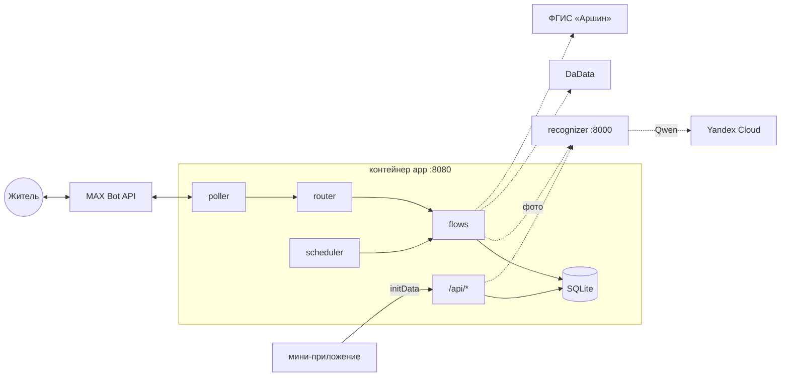

# Единый бот ЖКХ в MAX

Чат-бот и мини-приложение для мессенджера MAX (хакатон «Умный город»). Житель один раз регистрируется,
а дальше подаёт показания счётчиков фотографией: присылает снимок в чат, бот распознаёт цифры и заводской
номер, показывает их на проверку и записывает. Бот напоминает о сроках подачи, поверки и оплаты,
а собственник может открыть доступ к квартире семье или арендатору.

- Бот: `t226_hakaton_max_bot` (поиск в MAX).
- Мини-приложение: `https://maxsmartcity.ru/`, открывается внутри MAX кнопкой «Мини-приложение».

## Что умеет

- **Регистрация** в три шага: ФИО, телефон (кнопкой «Отправить мой номер» или текстом), адрес.
  Адрес ищется в DaData (ФИАС) или разбирается локально.
- **Подача по фото.** Фото можно прислать в любой момент, даже до регистрации. Бот спрашивает, какой это счётчик,
  распознаёт показание и серийный номер, показывает экран проверки («Отправить», «Исправить», «Переснять»).
  Не распознал — называет причину (блик, размыто, нет цифр) и предлагает переснять или ввести вручную.
- **Проверки показания:** формат, «меньше прошлого», слишком большой прирост, повторная подача за месяц.
- **Серийный номер** обязателен: сверяется с сохранённым, проверяется по типу счётчика.
- **Поверка по ФГИС «Аршин»**: после первой подачи с номером бот находит запись о поверке в реестре
  Росстандарта; нет записи — спрашивает дату из паспорта.
- **Меню-дашборд**: что подано за месяц, срок подачи, счёт, ближайшая поверка; самое срочное — первой кнопкой.
- **Уведомления**: открылось окно подачи и последние дни, поверка через 30/7/1 день и просрочка, счёт за 5/1 день.
- **Права по адресу**: первый зарегистрированный — собственник, следующие просят у него доступ.
- **«Поделиться доступом»**: одноразовая ссылка на один или несколько адресов, «Общий доступ», закрыть доступ, выйти.
- **Мини-приложение**: главная с дашбордом, подача по фото или вручную, история счётчика, профиль, общий доступ.

## Что смоделировано

Моки помечены прямо в сообщениях бота и в мини-приложении.

| Что | Как сейчас | Что нужно для реальной работы |
|---|---|---|
| Распознавание без ключей Yandex Cloud | демо-заглушка: прошлое показание + правдоподобный прирост, пометка «Демо-распознавание» | `YC_API_KEY` и `YC_FOLDER_ID` в `.env` |
| Распознавание света, газа, тепла | модель читает табло, но точность не измерена: бот всегда просит проверить цифры | датасеты и замер точности |
| Передача показаний в УК | показание хранится только у нас, пометка «передача в УК смоделирована» | API УК, РСО или ГИС ЖКХ |
| Окно подачи | с 15 по 25 число для всех адресов (`SUBMIT_DAY_FROM/TO`) | график УК по адресу |
| Счета | один демо-счёт на адрес за прошлый месяц, оплатить до 10-го | начисления из биллинга |
| Оплата и запись на поверку | честные заглушки «появится скоро» | платёжный сервис, сервис записи |
| Права собственника | первый зарегистрированный по адресу — собственник | данные УК или ЕГРН |
| Адрес без `DADATA_API_KEY` | локальный разбор, пометка «не сверен с ФИАС» | ключ DaData |
| Тестовый профиль | `/demo_profile` создаёт вымышленный профиль (только для хакатона) | удалить после хакатона |

Распознавание проверено на водомерах (датасет Yandex.Toloka, 373 фото вне подбора промпта): 74% показаний
точно, 91% верных целых м³, около 2,7 с на фото. Подробности и методика — в
[README сервиса](services/recognizer/README.md#качество).

## Быстрый старт

Нужен Docker с Compose v2.24+.

```bash
cp .env.example .env          # впишите BOT_TOKEN; без него работает только веб-часть
docker compose up -d --build
curl -s localhost:8080/api/health          # {"ok":true}
docker compose logs -f app                 # ждём «MAX bot: id=…» и «polling started»
```

Поднимаются два контейнера: `app` (бот, API, мини-приложение, порт 8080) и `recognizer` (распознавание,
порт 8000 только на 127.0.0.1). Данные лежат в `./data` и переживают `docker compose down`.

**Настоящее распознавание.** Впишите в `.env` ключи Yandex Cloud (сервисный аккаунт с ролью
`ai.languageModels.user`) и перезапустите `docker compose up -d --build`:

```bash
YC_API_KEY=...
YC_FOLDER_ID=...
```

Compose сам передаст боту адрес `http://recognizer:8000/recognize`. Проверка: `curl -s localhost:8000/health`,
`services/recognizer/recognize.sh фото.jpg` печатает, что сервис увидел на фото.

**Один токен — один процесс.** Два экземпляра бота с одним токеном делят апдейты MAX между собой.
Если бот уже работает на сервере, для локального запуска заведите своего бота.

**Без Docker:**

```bash
python3.12 -m venv .venv && . .venv/bin/activate && pip install -r requirements.txt
uvicorn app.main:app --env-file .env --port 8080
```

**Мини-приложение локально:** `DEV_AUTH=true` в `.env`, затем `http://localhost:8080/app/?dev_user=<MAX user_id>`.

## Переменные окружения

Все переменные бота читает `app/config.py`; `.env.example` — шаблон с комментариями.

| Переменная | Назначение | По умолчанию |
|---|---|---|
| `BOT_TOKEN` | токен бота MAX. Пусто — бот и уведомления выключены, работают API и мини-приложение | — |
| `BOT_USERNAME` | username бота для кнопки мини-приложения | из `GET /me` |
| `MAX_API_BASE` | адрес Bot API | `https://platform-api2.max.ru` |
| `DADATA_API_KEY` | подсказки адресов DaData. Пусто — локальный разбор | — |
| `RECOGNIZER_URL` | сервис распознавания. Пусто — демо-заглушка (в compose при заданном `YC_API_KEY` подставляется сам) | — |
| `ARSHIN_MODE` | ФГИС «Аршин»: `live` — реестр, `fixtures` — демо-данные без сети, `off` — выключено | `live` |
| `ARSHIN_BASE` | адрес API ФГИС | `https://fgis.gost.ru/fundmetrology/eapi` |
| `ARSHIN_FALLBACK_IPS` | IP хоста ФГИС через запятую, если DNS в контейнере его не находит. Пусто — выключено | `212.164.138.19,212.164.138.14` |
| `DEMO_MODE` | `/demo` с примерами уведомлений и кнопка «Открыть доступ (демо)» | `true` |
| `HACKATHON_DEMO_PROFILE` | команда `/demo_profile` (только для хакатона) | `true` |
| `DEV_AUTH` | заголовок `X-Dev-User` вместо initData, только для локальной разработки | `false` |
| `INIT_DATA_TTL` | срок действия initData мини-приложения, секунды | `86400` |
| `MINIAPP_ORIGINS` | CORS: домены мини-приложения, если оно открыто не с домена API | — |
| `DATA_DIR` | каталог SQLite и временных фото | `data` |
| `TZ` | часовой пояс сроков и уведомлений | `Europe/Moscow` |
| `SUBMIT_DAY_FROM`, `SUBMIT_DAY_TO` | окно подачи, числа месяца | `15`, `25` |

Переменные контейнера `recognizer` (из того же `.env`): `YC_API_KEY`, `YC_FOLDER_ID`, `YC_MODEL`
(`qwen3.6-35b-a3b`), `YC_TIMEOUT` (`15` с). `MAX_TEST_USER_ID` читает только `tools/live_smoke.py`.

## Как устроено


```mermaid
flowchart LR
  U((Житель)) <--> MAX[MAX Bot API]
  subgraph app["контейнер app :8080"]
    P[poller] --> R[router] --> F[flows]
    S[scheduler] --> F
    API["/api/*"]
    F --> DB[(SQLite)]
    API --> DB
  end
  MAX <--> P
  MA[мини-приложение] -- initData --> API
  F -. фото .-> REC[recognizer :8000] -. Qwen .-> YC[Yandex Cloud]
  API -.-> REC
  F -.-> DD[DaData]
  F -.-> FG[ФГИС «Аршин»]
```

Один процесс FastAPI: long polling MAX, роутер и сценарии бота, планировщик уведомлений и API мини-приложения.
Бизнес-логика общая для бота и API: подача (`app/readings.py`), дашборд (`app/domain/dashboard.py`),
общий доступ (`app/sharing.py`).

```
app/
  main.py            FastAPI: /api/*, статика /app/, в lifespan — poller и scheduler
  config.py clock.py настройки из окружения; время МСК (в тестах подменяется)
  db.py schema.sql   SQLite (WAL), миграции по PRAGMA user_version
  repo.py            весь SQL
  readings.py        подача показания: проверки и запись
  sharing.py         «Поделиться доступом»
  verification.py    поверка по ФГИС «Аршин»
  scheduler.py       уведомления, чистка фото, суточное обновление поверки
  domain/            чистые функции: счётчики, адреса, люди, права, серийные номера, поверка, дашборд
  integrations/      внешний HTTP: MAX, распознавание, DaData, ФГИС
  bot/               события, роутер, сессии, кнопки; flows/ — сценарии; texts/ — все тексты (YAML)
  web/               авторизация initData, /api/*, static/ — мини-приложение (vanilla JS)
services/recognizer/ сервис распознавания: фото → Qwen в Yandex Cloud → показание и номер
tests/               pytest: сценарии через настоящий роутер и FakeMaxApi
tools/               live_smoke.py — живая проверка MAX API; transcript.py — пример диалога
```

## Проверка вручную

| # | Действие в MAX | Что должно произойти |
|---|---|---|
| 1 | Найти бота, нажать «Начать» или написать «привет» | приветствие и вопрос ФИО |
| 2 | ФИО, телефон («Отправить мой номер» или текстом), адрес | сводка и кнопка «Всё верно» → меню-дашборд с демо-счётом |
| 3 | Прислать фото счётчика, выбрать тип и адрес (у нового профиля счётчиков нет — бот сразу спросит тип) | «Смотрим на фото…», экран проверки |
| 4 | Номер на фото не виден → «Ввести номер» (например, `18-452178`) → «Отправить» | «Готово! Записали …», поверка из ФГИС или вопрос о дате из паспорта |
| 5 | Фото с подписью «ошибка» (только демо-распознавание) | «Не получилось распознать показание» с причиной |
| 6 | `/demo` → «О поверке», «О счёте» | настоящие уведомления с рабочими кнопками |
| 7 | «Мини-приложение» в меню | главная, подача, история счётчика |
| 8 | «Профиль» → «Удалить мои данные» → «Удалить» | данные удалены, следующее сообщение — снова регистрация |

Вместо регистрации можно отправить `/demo_profile`: бот создаст вымышленный профиль с двумя адресами,
счётчиками, историей за полгода и общим доступом. Если адрес из примера уже занят другим проверяющим,
бот скажет «нет прав» — нажмите «Открыть доступ (демо)».

## Разработка

```bash
python -m pytest -q                        # тесты бота (~2 с), без сети и токена
ruff check app tools tests                 # линтер (pip install ruff; настройки — ruff.toml)
(cd services/recognizer && python -m pytest -q)   # тесты сервиса распознавания
python -m tools.transcript > docs/dialog-example.md   # пересобрать пример диалога
python -m tools.live_smoke --dry-run       # запросы живой проверки MAX без сети
```

Правила кода и проверенные факты о MAX API — в [CLAUDE.md](CLAUDE.md).

## Документация

- [docs/architecture.md](docs/architecture.md) — компоненты, путь апдейта, данные, интеграции, безопасность.
- [docs/bot.md](docs/bot.md) — сценарии бота: состояния, правила роутера, кнопки, уведомления, общий доступ.
- [docs/api.md](docs/api.md) — HTTP API мини-приложения.
- [docs/deploy.md](docs/deploy.md) — прод-сервер и обновление.
- [docs/live-checklist.md](docs/live-checklist.md) — живая проверка в MAX.
- [docs/dialog-example.md](docs/dialog-example.md) — пример переписки (генерируется из кода).
- [services/recognizer/README.md](services/recognizer/README.md) — сервис распознавания.
- [app/bot/texts/yaml/README.md](app/bot/texts/yaml/README.md) — как править тексты бота.
