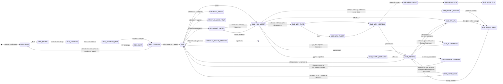

# Сценарий бота: состояния и переходы

Состояние диалога хранится в таблице `sessions` (`app/bot/states.py`, `app/bot/session.py`) и переживает перезапуск.
Регистрация не истекает. Подача (`SUB_*`) и профиль (`PROFILE_*`) сбрасываются через 30 минут бездействия.
Код сценариев лежит в `app/bot/flows/`, общие правила в `app/bot/router.py`, тексты в `app/bot/texts/`.

## Точки входа

| # | Что пришло | Что делает бот |
|---|---|---|
| 1 | Любое сообщение или «Начать» (`bot_started`) | новому пользователю: приветствие и регистрация (`REG_NAME`). Зарегистрированному: меню-дашборд |
| 2 | Фото | незарегистрированному: бот запоминает фото на 24 часа и разбирает после регистрации. Зарегистрированному: подача по этому фото. Посреди подачи фото заменяет прежнее |
| 3 | Уведомление бота (срок подачи, поверка, счёт) | у каждого уведомления есть кнопка действия и «В меню». Кнопка перед действием проверяет, актуально ли оно (например, «уже подано») |

## Карта состояний

```mermaid
stateDiagram-v2
  direction LR
  [*] --> REG_NAME: первое сообщение
  REG_NAME --> REG_PHONE: ФИО
  REG_PHONE --> REG_ADDRESS: контакт или номер
  REG_ADDRESS --> REG_ADDRESS_PICK: варианты адреса
  REG_ADDRESS_PICK --> REG_FLAT: нет квартиры
  REG_ADDRESS_PICK --> REG_CONFIRM: вариант выбран
  REG_FLAT --> REG_CONFIRM
  REG_CONFIRM --> IDLE: «Всё верно» → меню
  REG_CONFIRM --> REG_NAME: «Изменить имя» (так же телефон и адрес)

  IDLE --> SUB_AWAIT_PHOTO: «Подать показания»
  IDLE --> SUB_PICK_METER: фото
  SUB_AWAIT_PHOTO --> SUB_PICK_METER: фото или «Ввести вручную»
  SUB_PICK_METER --> SUB_NEW_TYPE: «Новый счётчик» или счётчиков нет
  SUB_NEW_TYPE --> SUB_NEW_TARIFF: свет
  SUB_NEW_TYPE --> SUB_NEW_ADDRESS
  SUB_NEW_TARIFF --> SUB_NEW_ADDRESS
  SUB_NEW_ADDRESS --> SUB_ADDR_INPUT: «Другой адрес»
  SUB_ADDR_INPUT --> SUB_ADDR_PICK
  SUB_ADDR_PICK --> SUB_ADDR_FLAT
  SUB_PICK_METER --> SUB_REVIEW: распознали
  SUB_NEW_ADDRESS --> SUB_REVIEW: распознали
  SUB_PICK_METER --> SUB_MANUAL: без фото
  SUB_PICK_METER --> SUB_SERIAL_MISMATCH: другой серийник
  SUB_SERIAL_MISMATCH --> SUB_REVIEW: «Это он»
  SUB_PICK_METER --> SUB_AWAIT_PHOTO: не распознали
  SUB_PICK_METER --> SUB_SERIAL_MISSING: номера нет ни у счётчика, ни на фото
  SUB_SERIAL_MISSING --> SUB_SERIAL_INPUT: «Ввести номер»
  SUB_MANUAL --> SUB_SERIAL_INPUT: без фото и без номера
  SUB_SERIAL_INPUT --> SUB_REVIEW: номер принят
  SUB_REVIEW --> SUB_MANUAL: «Исправить»
  SUB_MANUAL --> SUB_REVIEW: все поля введены
  SUB_REVIEW --> SUB_PLAUSIBILITY: меньше прошлого или большой прирост
  SUB_REVIEW --> SUB_REPLACE_CONFIRM: за месяц уже подано
  SUB_PLAUSIBILITY --> IDLE: «Да, всё верно» → записано
  SUB_REPLACE_CONFIRM --> IDLE: «Заменить» или «Оставить старое»
  SUB_REVIEW --> IDLE: «Отправить» → записано
  SUB_REVIEW --> SUB_VERIF_DATE: новый счётчик, в ФГИС не нашли или несколько вариантов
  SUB_VERIF_DATE --> IDLE: вариант ФГИС, дата или «Позже»

  IDLE --> PROFILE_PHONE: «Изменить телефон»
  IDLE --> PROFILE_ADDR_INPUT: «Добавить адрес»
  IDLE --> PROFILE_DELETE_CONFIRM: «Удалить мои данные»
  PROFILE_DELETE_CONFIRM --> [*]: «Удалить»
```

На схеме не показаны переходы, которые есть почти на каждом шаге:
- «Назад» ведёт на предыдущий шаг.
- «Отмена» во всех `SUB_*` пишет «Подачу отменили» и показывает меню.
- «Переснять» ведёт в `SUB_AWAIT_PHOTO`. Если счётчик уже выбран, новое фото распознаётся сразу.
- Выбор адреса нового счётчика (`SUB_ADDR_*`) заканчивается распознаванием или ручным вводом, как `SUB_NEW_ADDRESS`.
- Правка из сводки регистрации (`REG_CONFIRM` → «Изменить …») сразу возвращает к сводке.

После отправки показание проверяет общий сервис `app/readings.py` (им пользуется и мини-приложение) в таком порядке:
права → формат → уже подано за месяц → меньше прошлого → прирост выше порога.

Серийный номер обязателен. Номер с фото сверяется с сохранённым: другой номер или номер другого счётчика
пользователя — `SUB_SERIAL_MISMATCH` (выбрать тот счётчик или продолжить с текущим). Номер проверяется по типу (`domain/serials.validate_serial`: год, ГОСТ, класс, пломба —
не номер; необычная длина — предупреждение, но сохраняем).

Поверка нового счётчика: после записи бот до 6 с ищет номер в ФГИС «Аршин» (`arshin_service.check_within`).
Уверенно нашли — строка «Поверка по данным ФГИС «Аршин»: до …» и кнопка «Запись в ФГИС», вопроса о дате нет.
Несколько приборов с этим номером — «Это ваш счётчик?» с вариантами, «Ни один» и вводом даты (`SUB_VERIF_DATE`).
Не нашли или ФГИС не ответил — вопрос о дате из паспорта; не успели за 6 с — проверка доделывается в фоне.

Переход в «нет прав»: если все адреса пользователя ждут разрешения собственника или выбранный новый адрес
принадлежит другому собственнику, бот удаляет фото, пишет «По адресу … уже зарегистрирован собственник»
и даёт кнопку «Запросить доступ». Собственник получает запрос с кнопками «Разрешить» / «Отклонить».
При `DEMO_MODE=true` есть ещё «Открыть доступ (демо)»: одобряем за собственника (`access=granted`, роль `tenant`).
### Поделиться доступом (flows/invite.py, app/sharing.py)

Делятся адресом, не счётчиком и не профилем. Все кнопки глобальные (`g|…`), состояний сессии нет, кроме регистрации.

- «Поделиться доступом» (`g|share|[aid]`): один свой адрес — сразу ссылка; несколько — выбор кнопками-переключателями
  «✓ Арбат…» (`g|sh_sel|<id.id>`, сообщение меняется на месте, «Все адреса») → «Готово» (`g|sh_go|<id.id>`).
  Ссылка `max.ru/<бот>?start=inv_<token>` (7 дней, одна на одного человека, не больше 5 действующих) — отдельным
  сообщением без разметки для пересылки, следом пояснение. Нет своих адресов — «делиться можно адресами, где вы собственник».
- «Общий доступ» (`g|sh_list`): «Вы делитесь» (адрес — люди), «Ссылки ждут ответа» (`g|inv_cancel|id`),
  «Вам открыли доступ» (адрес — «доступ от Анны И.»). Адрес (`g|acc_list|aid`): собственнику — люди со статусом
  («показания 12.10» / «за октябрь показаний нет» / «ждёт одобрения»), «Закрыть: Имя» → подтверждение → `denied`
  (получателю сообщение), «Разрешить: Имя» для запросов; получателю — «Выйти» → подтверждение → связь удаляется
  (собственнику сообщение, если доступ был открыт).
- Ссылка у зарегистрированного: «Принять»/«Отказаться» (`g|inv_ok|token`/`g|inv_no|token`); свой адрес пропускается,
  `pending`/`denied` → `granted`, уже открытый — «у вас уже есть доступ» без траты ссылки; своя ссылка, истёкшая,
  использованная, отменённая, адрес уже не отправителя — свой текст.
- Ссылка у незарегистрированного: токен в `data["invite"]` (переживает перезапуск регистрации), «Анна И. хочет открыть вам
  доступ… Сначала коротко познакомимся» → ФИО → телефон → `REG_ADDRESS` с кнопкой «Других адресов нет» (`reg.no_address`;
  введённый адрес — свой, в том числе адрес из ссылки — дубля нет) → сводка с «Доступ от Анны И.: …» → «Всё верно» →
  принятие → «Готово… Доступ от Анны И. к адресу … открыт» + меню. Ссылка истекла до «Всё верно» без своего адреса —
  «Ссылка уже не действует» и снова `REG_ADDRESS`.
- Удаление аккаунта: получатель — собственнику «Пётр С. удаляет свой профиль…»; собственник — адрес переходит первому
  получателю с доступом (`role=owner`, ему сообщение с пометкой о модели прав), его ссылки удаляются.
- Диплинки мини-приложения: `inv_new_<aid>` (поделиться адресом), `inv_acc_<aid>` (адрес), `shares`, `help`.

## Правила роутера для неожиданного ввода

Роутер применяет правила сверху вниз до первого подходящего. Затем событие получает обработчик текущего состояния.
До всех правил повторы апдейтов отбрасываются, события одного пользователя обрабатываются по очереди,
а на каждое нажатие кнопки бот отвечает MAX (`POST /answers`), чтобы кнопка не «крутилась».

| Ситуация | Реакция |
|---|---|
| Подача или профиль простояли больше 30 минут | «Прошлая подача прервалась — начнём заново» и меню. Фото удаляется, новое фото начинает подачу заново |
| Незарегистрированный пишет что угодно вне регистрации | приветствие и вопрос ФИО. Фото запоминается на 24 часа |
| Кнопка меню или уведомления (payload `g\|…`) во время регистрации | всплывающее «Сначала закончим регистрацию» и повтор шага |
| Кнопка меню или уведомления во время подачи или профиля | «Предыдущую подачу отменили» (если уже было фото, выбран счётчик или адрес; или «Изменение профиля отменили»), действие выполняется новым сообщением |
| Кнопка из старого сообщения (чужой `flow_id`) | всплывающее «Эта кнопка уже не работает», кнопки у старого сообщения снимаются, шаг повторяется |
| `/start`, «меню» во время регистрации | «Продолжим с того же места» с кнопкой «Начать заново», повтор шага |
| `/start`, «меню» в остальных случаях | отмена текущей подачи или профиля, меню |
| «отмена», «стоп» во время регистрации | «Регистрацию можно начать заново или продолжить…» с кнопками «Начать заново» / «Продолжить» |
| «отмена», «стоп» в остальных случаях | «Подачу отменили» и меню |
| Неизвестная команда `/…` | «Такой команды нет» и повтор шага |
| `/demo` во время регистрации | «Сначала закончим регистрацию» и повтор шага |
| Фото во время регистрации | «Фото запомнили — разберём сразу после регистрации» и повтор шага |
| Фото в профиле или на вопросе о дате поверки | этот шаг бросается, начинается новая подача |
| Фото во время подачи | «Взяли новое фото», подача продолжается с ним |
| Альбом из нескольких фото | «Взяли первое фото из нескольких» |
| Стикер, файл, геолокация, контакт не к месту | «Пока мы понимаем только текст, фото и кнопки» и повтор шага |
| Текст там, где ждём кнопку | «да», «верно», «нет», «назад» срабатывают как кнопки, остальное повторяет шаг |
| Число вместо фото или на проверке | считается ручным вводом показания |
| Текст на шаге выбора адреса (кроме «да», «нет», «назад») | новый поиск адреса |
| Свободный текст в меню (`IDLE`) | меню без повтора введённого |
| Сбой обработчика | «Что-то пошло не так на нашей стороне…» с кнопками «Повторить» / «В меню». Состояние не меняется, в логе `trace=` |
