# Сценарии бота

Код: общие правила — `app/bot/router.py`, сценарии — `app/bot/flows/`, состояния — `app/bot/states.py`,
тексты — `app/bot/texts/yaml/`. Пример переписки целиком — [dialog-example.md](dialog-example.md).

## Сессия и состояния

Состояние диалога хранится в `sessions` и переживает перезапуск. Регистрация (`REG_*`) не истекает. Подача
(`SUB_*`) и изменение профиля (`PROFILE_*`) сбрасываются через 30 минут без ответа. В `IDLE` пользователь в меню.

```mermaid
stateDiagram-v2
  direction LR
  [*] --> REG_NAME: первое сообщение
  REG_NAME --> REG_PHONE
  REG_PHONE --> REG_ADDRESS
  REG_ADDRESS --> REG_ADDRESS_PICK: варианты
  REG_ADDRESS_PICK --> REG_FLAT: нет квартиры
  REG_ADDRESS_PICK --> REG_CONFIRM
  REG_FLAT --> REG_CONFIRM
  REG_ADDRESS --> REG_CONFIRM: «Других адресов нет» (по ссылке)
  REG_CONFIRM --> IDLE: «Всё верно»

  IDLE --> SUB_AWAIT_PHOTO: «Подать показания»
  IDLE --> SUB_PICK_METER: фото
  SUB_AWAIT_PHOTO --> SUB_PICK_METER: фото или «Ввести вручную»
  SUB_PICK_METER --> SUB_NEW_TYPE: «Новый счётчик» / счётчиков нет
  SUB_NEW_TYPE --> SUB_NEW_TARIFF: электричество
  SUB_NEW_TYPE --> SUB_NEW_ADDRESS
  SUB_NEW_TARIFF --> SUB_NEW_ADDRESS
  SUB_NEW_ADDRESS --> SUB_ADDR_INPUT: «Другой адрес»
  SUB_ADDR_INPUT --> SUB_ADDR_PICK
  SUB_ADDR_PICK --> SUB_ADDR_FLAT
  SUB_PICK_METER --> SUB_REVIEW: распознали
  SUB_PICK_METER --> SUB_AWAIT_PHOTO: не распознали
  SUB_PICK_METER --> SUB_SERIAL_MISMATCH: номер на фото другой
  SUB_PICK_METER --> SUB_SERIAL_MISSING: номера нет нигде
  SUB_SERIAL_MISSING --> SUB_SERIAL_INPUT: «Ввести номер»
  SUB_SERIAL_INPUT --> SUB_REVIEW
  SUB_PICK_METER --> SUB_MANUAL: без фото
  SUB_MANUAL --> SUB_REVIEW
  SUB_REVIEW --> SUB_MANUAL: «Исправить»
  SUB_REVIEW --> SUB_PLAUSIBILITY: меньше прошлого / большой прирост
  SUB_REVIEW --> SUB_REPLACE_CONFIRM: за месяц уже подано
  SUB_REVIEW --> IDLE: «Отправить» → записано
  SUB_REVIEW --> SUB_VERIF_DATE: новый счётчик без срока поверки
  SUB_VERIF_DATE --> IDLE

  IDLE --> PROFILE_PHONE: «Изменить телефон»
  IDLE --> PROFILE_ADDR_INPUT: «Добавить адрес»
  IDLE --> PROFILE_DELETE_CONFIRM: «Удалить мои данные»
```

Не показаны переходы, которые есть почти везде: «Назад» — на предыдущий шаг, «Отмена» в подаче — «Подачу
отменили» и меню, «Переснять» — снова ждём фото (если счётчик уже выбран, новое фото распознаётся сразу).
Выбор адреса нового счётчика (`SUB_ADDR_*`, `SUB_NEW_ADDRESS`) заканчивается распознаванием, ручным вводом
или просьбой прислать фото — как после выбора счётчика.

## Правила роутера

Правила проверяются сверху вниз до первого подходящего; остальное получает обработчик текущего состояния.

| Ситуация | Реакция |
|---|---|
| Подача или профиль простояли больше 30 минут | сценарий сброшен (фото удалено), «Прошлая подача прервалась…» и меню. Новое фото начинает подачу заново |
| Диплинк `start=inv_…` | точка входа приглашений — в любом состоянии и до регистрации |
| Команда, доступная без профиля (`/demo_profile`) | выполняется, начатая регистрация бросается |
| Незарегистрированный вне регистрации | приветствие и вопрос ФИО; присланное фото запоминается на 24 часа |
| Глобальная кнопка (меню, уведомление, карточка) во время регистрации | всплывающее «Сначала закончим регистрацию» и повтор шага |
| Глобальная кнопка в остальных случаях | текущая подача или профиль отменяются (строка «Предыдущую подачу отменили», если было что терять), действие — новым сообщением |
| Кнопка из старого сообщения | всплывающее «Кнопка уже неактуальна», кнопки у старого сообщения снимаются, шаг повторяется |
| `/start`, «меню», «старт», «главное меню», `/menu` | в регистрации — «Продолжим с того же места» и кнопка «Начать заново»; иначе — отмена сценария и меню |
| «отмена», «отменить», «стоп», `/cancel` | в регистрации — «начать заново или продолжить»; иначе — «Подачу отменили» и меню |
| Неизвестная команда `/…` | «Такой команды нет» и повтор шага; в регистрации команды не работают |
| Фото во время регистрации | «Фото запомнили — разберём сразу после регистрации», повтор шага |
| Фото в профиле или на вопросе о дате поверки | тот сценарий бросается, начинается подача с этим фото |
| Фото во время подачи | «Взяли новое фото», подача продолжается с ним |
| Альбом из нескольких фото | «Взяли первое фото из нескольких» |
| Стикер, файл, геолокация, контакт не к месту | «Пока понимаем текст, фото и кнопки» и повтор шага |
| Текст там, где ждём кнопку | «да», «верно», «всё верно», «нет», «назад» работают как кнопки, остальное повторяет шаг |
| Свободный текст в меню | меню (введённое не повторяется) |
| Сбой обработчика | «Что-то пошло не так на нашей стороне…» с «Повторить» / «В меню»; состояние не меняется, в логе `trace=` |

## Регистрация

`flows/registration.py`. Приветствие со списком возможностей, затем три шага:

1. **ФИО** — 2–4 слова кириллицей, 2–30 букв в слове. Если имя из профиля MAX проходит проверку, есть кнопка
   «Это я: …».
2. **Телефон** — кнопка «Отправить мой номер» (контакт из MAX, в профиле помечается «номер из MAX») или текстом.
   Принимаются только российские номера; чужой контакт отклоняется.
3. **Адрес** — одной строкой. Один вариант — «Мы поняли так: … Верно?», несколько — список кнопками, нет квартиры —
   вопрос о квартире или «Частный дом». DaData дом не нашла — можно «Сохранить как есть» (адрес помечается
   «не сверен с ФИАС»).

Сводка с кнопками «Всё верно», «Изменить имя/телефон/адрес»; после правки бот возвращается к сводке.
«Всё верно» одной транзакцией сохраняет профиль и адрес (с демо-счётом), затем:
- адрес уже принадлежит другому собственнику → сообщение «нет прав» и меню;
- до регистрации присылали фото → сразу подача с ним;
- иначе меню с «Готово, вы зарегистрированы».

По ссылке «Поделиться доступом» свой адрес необязателен: на шаге адреса есть «Других адресов нет», в сводке —
строка «Доступ от Анны И.: …», после «Всё верно» доступ открывается.

## Подача показаний

`flows/submission.py`, проверки и запись — `app/readings.py`.

**Вход.** Фото в любой момент, «Подать показания» (инструкция и «ПРИШЛИТЕ ВАШЕ ФОТО В ЧАТ»), «Ввести вручную»,
«Подать показания» в карточке счётчика или «Добавить счётчик». Число вместо фото считается ручным вводом.
Если ни по одному адресу пользователя нет доступа, бот сразу отвечает «нет прав».

**Счётчик.** «Какой это счётчик?» — кнопки счётчиков пользователя (больше 20 — страницами) и «Новый счётчик».
Новый: тип → для электричества число тарифов → адрес из своих или «Другой адрес» (тот же поиск, что в регистрации;
чужой адрес по модели прав — «нет прав», счётчик не создаётся). Счётчик создаётся вместе с первым показанием.

**Распознавание.** «Смотрим на фото…» (до 25 с). Не распознали — причины с советами («переснимите без бликов»)
и кнопки «Переснять», «Ввести вручную», «Отмена»; если на фото, похоже, счётчик другого типа — ещё
«Выбрать другой счётчик». У многотарифного счётчика на фото виден один тариф: остальные бот спрашивает вручную.

**Заводской номер.** Обязателен. Номер с фото сравнивается с сохранённым без учёта «№», пробелов и тире:
другой номер или номер другого счётчика того же адреса — «Это другой счётчик» / «Номер на фото неверный».
Номера нет ни у счётчика, ни на фото — «Переснять» / «Ввести номер». Номер проверяется по типу счётчика
(`domain/serials.py`): год, ГОСТ, класс, пломба — не номер; необычная длина — предупреждение, но номер сохраняется.
Если у нового счётчика номер с фото совпал с уже существующим счётчиком по адресу, подача переключается на него.

**Проверка.** Показание как прочитано, строка о номере, прошлое показание и прирост, конкретные предупреждения
о фото, пометка демо-распознавания. Кнопки «Отправить», «Исправить», «Переснять», «Отмена».

**Ручной ввод.** По одному полю на тариф, `123,456` или `123.456`. Разрядов не больше, чем на табло этого типа
(вода и газ — 5 целых и 3 дробных, свет — 6 и 2, тепло — 4 и 3).

**Отправка.** Проверки по порядку: права → формат → уже подано за месяц → меньше прошлого → прирост выше порога.
- Меньше прошлого — «Счётчик не крутится назад — проверьте цифры», отправить нельзя, только исправить.
- Прирост выше порога (в месяц: холодная вода 30 м³, горячая 20 м³, свет 1500 кВт·ч, газ 300 м³, тепло 5 Гкал,
  умноженное на число месяцев с прошлой подачи) — «Да, всё верно» записывает показание с отметкой для проверки.
- За месяц уже подано — «Заменить» / «Оставить старое».
- Записано — «Готово! Записали показание за …», пометка «передача в УК смоделирована», кнопки «В меню» и «Подать ещё».

**Поверка после подачи.** Если у счётчика есть номер, срок поверки не введён из паспорта и счётчик ещё
не проверяли, бот ищет номер в ФГИС «Аршин»
(до 6 с, дальше в фоне): нашли уверенно — «Поверка по данным ФГИС «Аршин»: до …» и кнопка «Запись в ФГИС»;
несколько приборов с этим номером — «Это ваш счётчик?» с вариантами; не нашли — объяснение. Если у нового
счётчика так и нет срока поверки, бот спрашивает дату из паспорта (`ДД.ММ.ГГГГ`, не в прошлом) или «Позже».

## Меню и счётчики

**Меню-дашборд** (`flows/menu.py`, текст — `domain/dashboard.py`): срочное, доступ («ждёт одобрения собственника»,
«доступ от Анны И.»), окно подачи и что подано по каждому счётчику (больше трёх счётчиков — одной строкой),
ближайшая поверка (если до неё не больше 60 дней) и счёт, демо-оговорки цитатой в конце.
Срочное — одно, по приоритету: поверка через 30 дней и меньше → счёт через 5 дней и меньше → последние 3 дня
окна подачи, если подано не всё. Кнопки: «Оплатить счёт · сумма», срочное действие, «Подать показания»,
«Мои счётчики», «Профиль», «Мини-приложение», «Помощь». Оплата и запись на поверку — заглушки «появится скоро».

**«Мои счётчики»**: по каждому счётчику последнее показание (кто подал, если не вы), срок поверки и его источник;
кнопки счётчиков ведут в карточку. **Карточка**: адрес, номер, последнее показание, поверка; «Подать показания»
по этому счётчику и «Удалить счётчик». Удаление мягкое — показания остаются; если к адресу есть доступ у других
людей, удалить может только собственник.

## Профиль и права по адресу

`flows/profile.py`, модель — `domain/access.py`. Профиль: ФИО, телефон, адреса с ролью; кнопки «Изменить телефон»,
«Добавить адрес», «Поделиться доступом» и «Общий доступ», «Запросить доступ» по адресам, которые ждут одобрения,
«Удалить мои данные».

Модель прав (заменяет данные УК или ЕГРН): первый зарегистрированный по адресу — собственник, остальные ждут
его разрешения. На «нет прав» бот предлагает «Запросить доступ»: собственнику приходит запрос с телефоном и кнопками
«Разрешить» / «Отклонить», ответ доходит до жильца один раз. Собственник удалил свои данные — адрес переходит
первому, кому он открыл доступ, а если таких нет — первому, кто запросит доступ. При `DEMO_MODE=true` есть «Открыть доступ (демо)»: доступ открывается за собственника.

## Поделиться доступом

`flows/sharing.py`, общая с API логика — `app/sharing.py`. Делятся **адресом**, а не счётчиком или профилем.

- «Поделиться доступом»: один свой адрес — ссылка сразу; несколько — выбор кнопками-переключателями (сообщение
  меняется на месте, есть «Все адреса») и «Готово». Ссылка `max.ru/<бот>?start=inv_<token>` приходит отдельным
  сообщением без разметки, чтобы её было удобно переслать. Действует 7 дней, срабатывает один раз; действующих
  ссылок у собственника не больше 5.
- Получатель с профилем: «Принять» / «Отказаться». Доступ открывается ко всем адресам ссылки (запрос и закрытый
  доступ становятся открытыми, свой адрес пропускается), собственнику приходит сообщение.
- Получатель без профиля: «Анна И. хочет открыть вам доступ… Сначала коротко познакомимся» → регистрация, где свой
  адрес необязателен.
- «Общий доступ»: кем вы делитесь (кто и когда подавал показания в этом месяце), неоткрытые ссылки с кнопкой
  отмены, чем поделились с вами. В адресе собственник может «Закрыть: Имя» или «Разрешить: Имя» (для запросов),
  получатель — «Выйти». Вторая сторона получает сообщение.
- Везде в интерфейсе общий адрес подписан «доступ от Анны И.», а не «арендатор».

## Уведомления

`flows/notify.py`, рассылка — планировщик: с 9:00 до 21:00 по `TZ`, не больше одного уведомления пользователю
за проход (раз в 10 минут), каждое — один раз. Приоритет: поверка → счёт → подача.

| Уведомление | Когда | Кнопки |
|---|---|---|
| Поверка | за 30, 7 и 1 день до срока и после него | «Записаться на поверку», «Запись в ФГИС» (если срок из ФГИС), «В меню» |
| Счёт (демо) | за 5 и за 1 день до срока оплаты | «Оплатить», «В меню» |
| Подача | открылось окно; последние 3 дня окна, если подано не всё | «Подать показания», «В меню» |

Кнопки уведомлений перед действием проверяют, актуально ли оно: всё уже подано, счёт оплачен, счётчик удалён
или срок поверки обновлён — бот говорит об этом и показывает меню.

## Команды и демо

| Команда | Что делает |
|---|---|
| `/start`, «меню» | меню (в регистрации — продолжение) |
| `/help`, «Помощь» | снова приветствие со списком возможностей |
| `/demo` | при `DEMO_MODE=true`: настоящие уведомления «О подаче», «О поверке», «О счёте» с рабочими кнопками и «Поверка в ФГИС» (если ФГИС не выключен) — проверка первого счётчика с номером. «О поверке» ставит модельный срок (+20 дней) счётчику без срока от пользователя или из ФГИС |
| `/demo_profile` | только для хакатона (`HACKATHON_DEMO_PROFILE`), у пользователя без профиля: вымышленный профиль — 2 адреса, 4–6 счётчиков, история за полгода, срочная поверка, демо-жильцы и доступ к чужому адресу. Демо-людям бот не пишет. Код — `flows/hackathon_demo.py`, в его docstring — что удалить после хакатона |

## Диплинки

Мини-приложение открывает чат ссылкой `max.ru/<бот>?start=<payload>`:

| payload | Действие |
|---|---|
| `submit`, `add_meter`, `meters` | подать показания, добавить счётчик, «Мои счётчики» |
| `profile`, `phone`, `add_address`, `delete_data` | профиль, изменить телефон, добавить адрес, удалить данные |
| `shares`, `help` | «Общий доступ», приветствие |
| `inv_<token>` | открыть ссылку-приглашение (в любом состоянии, до регистрации тоже) |
| `inv_new_<address_id>`, `inv_acc_<address_id>` | поделиться этим адресом; открыть этот адрес в «Общем доступе» |

Незарегистрированный пользователь по любому диплинку попадает в регистрацию.

## Тексты

Все тексты — в `app/bot/texts/yaml/*.yaml` (правила правки — в [README папки](../app/bot/texts/yaml/README.md)).
Стиль: «мы», к пользователю «вы», без эмодзи и канцелярита; важное — **жирным**, демо-оговорки — последней
строкой-цитатой. Пользовательский ввод экранируется перед разметкой.
