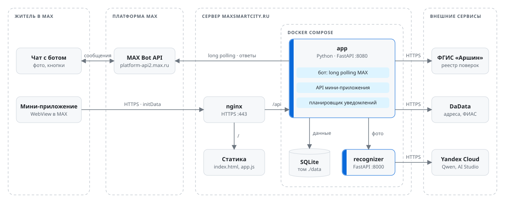

# Прод: maxsmartcity.ru

Бот, API и мини-приложение работают на одном сервере `https://maxsmartcity.ru`.

<picture>
  <source media="(prefers-color-scheme: dark)" srcset="img/architecture-dark.svg">
  
</picture>

- **nginx** настроен отдельно и деплоем не меняется: HTTPS-сертификат, прокси `/api/` на `127.0.0.1:8080`,
  статика из `/var/www/maxsmartcity.ru`. Мини-приложение и API на одном origin, поэтому CORS не нужен.
- **Репозиторий** — `~/max-smart-city-webapp`. Только на сервере лежат `.env` (права 600) и
  `compose.override.yaml` (в `.gitignore`): он публикует порт `app` только на `127.0.0.1:8080`.
- **Контейнеры** из `compose.yaml`: `app` и `recognizer`, `restart: unless-stopped`, у `app` healthcheck
  по `/api/health`. `app` работает от непривилегированного пользователя (uid 10001).
- **Данные** — `./data`: `bot.db` (SQLite), `photos/` (временные фото), `backups/` (копии БД).
- В `.env` не задаётся `RECOGNIZER_URL`: при заданном `YC_API_KEY` адрес `recognizer` боту даёт compose.
  `RECOGNIZER_URL=http://127.0.0.1…` сломал бы распознавание: внутри контейнера это сам `app`.
- **Один токен — один процесс.** Пока работает сервер, бот с тем же токеном локально не запускать
  (`docker compose stop app`), иначе апдейты MAX разделятся между двумя экземплярами.
- ФГИС «Аршин» отвечает только российским IP; если DNS в контейнере не резолвит `fgis.gost.ru`,
  помогает `ARSHIN_FALLBACK_IPS` (задан по умолчанию).

## Период проверки

По регламенту хакатона эксперты проверяют решение с 30.09.2026 12:00 МСК до объявления финалистов 14.10.2026.
Всё это время бот и мини-приложение должны работать, а код в репозитории после дедлайна не меняется.

- **До дедлайна:** задеплоить финальный коммит и указать его hash (`git rev-parse HEAD` на сервере) на первом
  слайде презентации; пройти [live-checklist.md](live-checklist.md) с чужого аккаунта MAX в приложении и в веб-версии;
  убедиться, что репозиторий доступен проверяющим, ссылки в README открываются, а чистая сборка
  (`docker compose build --no-cache`) укладывается в 5 минут, как требует регламент.
- **После дедлайна:** не деплоить и не пушить. Допустимы только перезапуск (`docker compose restart app`)
  и откат БД из копии — без изменения кода.
- **Раз в день:** `curl -s https://maxsmartcity.ru/api/health`, `docker compose ps` (оба `healthy`),
  нет ли новых ошибок в `docker compose logs --since 24h app`, место на диске (`df -h`), срок HTTPS-сертификата,
  баланс Yandex Cloud и лимит DaData.
- **Локально бота с прод-токеном не запускать:** второй процесс заберёт часть апдейтов, и проверяющие
  не получат ответа.

## Обновление

SSH-доступ и пароль sudo даёт владелец.

```bash
ssh user@<сервер>
cd ~/max-smart-city-webapp
bash deploy/update.sh              # текущая ветка
bash deploy/update.sh <ветка>      # переключиться на другую ветку
bash deploy/update.sh --static     # поменялась только app/web/static — без пересборки контейнеров
```

`deploy/update.sh` по шагам:
1. `git fetch` и `git pull --ff-only` (с аргументом — сначала переключает ветку).
2. Копия БД в `data/backups/bot-<время>.db` через SQLite backup API (хранятся 10 последних).
3. `docker compose up -d --build --remove-orphans --wait` и чистка старых образов.
4. Копирует `app/web/static/*` в `/var/www/maxsmartcity.ru` (нужен sudo); в `index.html` метка `?v=dev`
   заменяется хешем коммита, чтобы MAX не показывал старую версию из кэша.
5. Проверки: `docker compose ps`, `/api/health` изнутри и снаружи, `recognizer /health`, строки логов бота.

Ожидаемый итог: оба контейнера `(healthy)`, `{"ok":true}` от бота локально и через nginx,
`{"status":"ok",…}` от `recognizer`, в логе `MAX bot: id=423938205` и `polling started`.

## Проверки и повседневные команды

```bash
curl -s https://maxsmartcity.ru/api/health                                # {"ok":true}
curl -s -o /dev/null -w '%{http_code}\n' https://maxsmartcity.ru/api/me   # 401 без initData — так и должно быть
docker compose ps                                  # оба контейнера (healthy)
docker compose logs -f app                         # логи бота и API; распознавание — logs -f recognizer
docker compose restart app                         # перезапуск без пересборки
docker compose up -d                               # после правки .env: пересоздать контейнеры
curl -s -F image=@фото.jpg localhost:8000/recognize   # что сервис распознаёт на фото
```

После деплоя стоит пройти живую проверку: `python -m tools.live_smoke` локально (без `--listen`: слушание
отнимет апдейты у серверного бота) и раздел «Мини-приложение» из [live-checklist.md](live-checklist.md).

## Откат и восстановление БД

```bash
git checkout <коммит> && docker compose up -d --build --wait     # данные в ./data не трогаются

docker compose stop app
sudo cp data/backups/bot-<время>.db data/bot.db && sudo rm -f data/bot.db-wal data/bot.db-shm
docker compose start app
```

## Новый сервер

1. Docker Engine с Compose v2.24+, клон репозитория, `.env` из `.env.example` (минимум `BOT_TOKEN`,
   `BOT_USERNAME`; для распознавания `YC_API_KEY`, `YC_FOLDER_ID`; для адресов `DADATA_API_KEY`).
2. `compose.override.yaml`, чтобы `app` слушал только локально (`!override` заменяет список портов
   из `compose.yaml`, нужен Compose v2.24.4+):
   ```yaml
   services:
     app:
       ports: !override
         - "127.0.0.1:8080:8080"
   ```
3. nginx: HTTPS, `location /api/ { proxy_pass http://127.0.0.1:8080; }`, `root /var/www/<домен>` для статики.
4. `bash deploy/update.sh` (для другого домена поправьте `WWW` и адрес проверки в скрипте).
